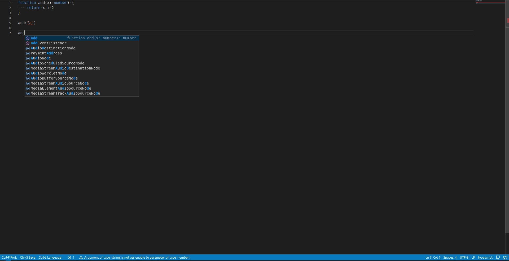

# Pastebin written in Rust

uses vs-code like `monaco-editor` ui and rust in the backend:

The editor should support all the languages that monaco editor supports.
the language are downloaded at runtime, depending on the language user sets. 

to set the langugage press `Ctrl-l` or the button at the bottom bar. and then
type the name of the language in prompt.

## deployment:
the bin is written in Rust, so the server is statically linked binary of size 3MB.
all you need to do is serve the assets with it (Only images and css file specifically).

to deploy, compile a release build, and start the server with your preferred way, make sure 
you put `assets` dir from the repo the same level as binary. binary will create `pastes`
folder to store pastes automatically. 
